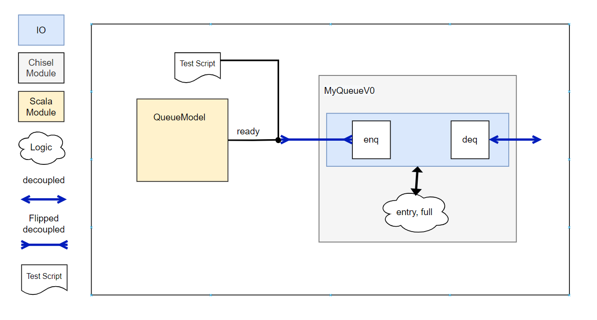
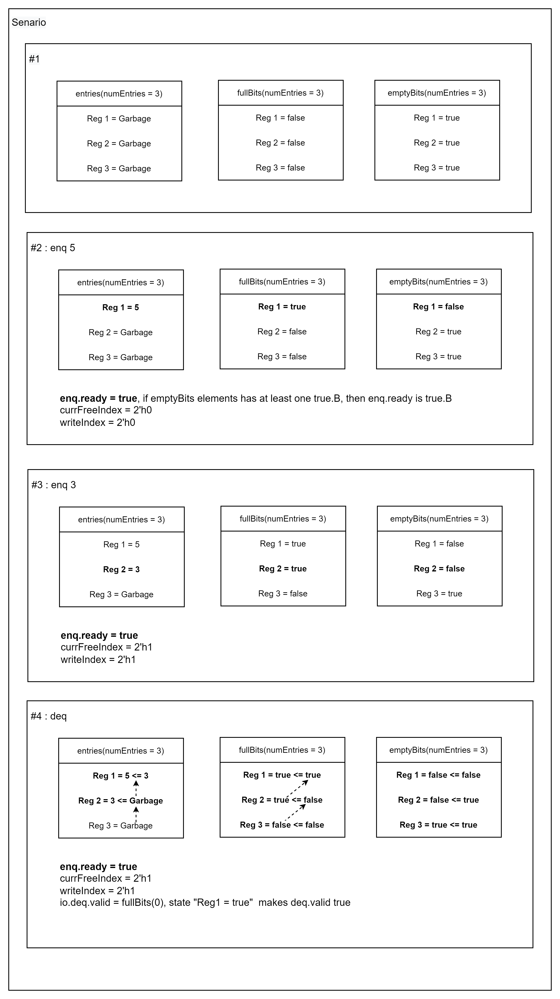
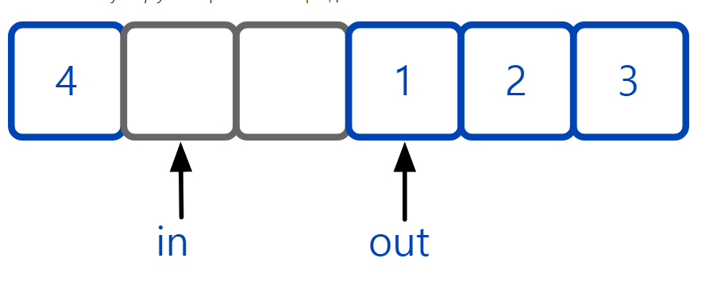

 

# 13-queue
https://github.com/agile-hw/lectures/

### Assessing MyQueue V0

- Accomplished
  - Implements queueing behavior
  - Parameterized data width (still limited to UInt)
- Shortcommings
  - Only one entry (next goal to fix)

<h4 align="center">  MyQueue V0 </h4>

### Assessing MyQueue V1
- Accomplished
  - Implements queueing behavior
  - Parameterized data width & number of entries
- Shortcommings
  - Long latency when queue is empty (all elements go through all entries)
  - Not good at handling bubbles midway (might even be buggy)

 

<h4 align="center">  MyQueue V1 </h4>

### Assessing MyQueue V2 - Priority Encoder
- Accomplished
  - Implements queueing behavior
  - Parameterized data width & number of entries
  - Latency based on occupancy
- Shortcommings
  - Performance: can't simultaneously enqueue/dequeue to a full queue
  - Power Efficiency: lots of bits shifting
  - Potential Critical Path: priority encoder logic depth

### Squishing Bubbles in Queue
- Use a Priority Encoder to squeeze out bubbles
  - Insert in first free slot

<h4 align="center">  MyQueue V2 </h4>

### Keeping Data in Place with a Circular Buffer
- Circular buffer uses two pointers (indices) and fixed size storage to make a FIFO
  - Insert new data at in (and increment in)
  - Pop from out (and increment out)
  - Wrap pointers around when they get to end
- How to tell when empty vs full?
  - First try: empty when pointers are equal, full when in+1 == out

 

### Assessing MyQueue V3
- Accomplished
  - Implements queueing behavior
  - Parameterized data width & number of entries
  - Latency based on occupancy
  - Efficiency? Less bits shifting and shallower logic
- Shortcommings
  - Capacity: loose one entry (to detect if full), and must be power of 2
  - Performance: can't simultaneously enqueue/dequeue to a full queue
  - 
 

### Reclaiming Last Entry
- Problem: with circular buffer (initially), had to keep last entry empty to differentiate a full queue from an empty queue
  - Otherwise, if enqIndex === deqIndex, is it full or empty?
  
-  Solution: add an extra bit of state (maybeFull) to capture this corner case     
  - If indices are equal and maybeFull => full  
  - If indices are equal and !maybeFull => empty  
  - If indices are not equal => not full or empty (has room)

 

<h4 align="center">  buffer example </h4>

### Assessing MyQueue V5

- Accomplished
  - Implements queueing behavior
  - Parameterized data width & number of entries
  - Latency based on occupancy
  - Efficiency? Less bits shifting and shallower logic
  - Can now enqueue/dequeue in same cycle
- Shortcommings
  - Capacity: must be power of 2
  - Possible combinational loop more likely with io.enq.ready now attached to io.deq.ready

 

### V6 - Tidying up Code
- Assessing MyQueue V6
  - Accomplished
  - Implements queueing behavior
  - Parameterized data width & number of entries
  - Latency based on occupancy
  - Efficiency? Less bits shifting and shallower logic
  - Can now enqueue/dequeue in same cycle (optionally) and support non-power of 2 capacities
- Shortcommings
  - Data type is UInt - What about arbitrary data?

   
